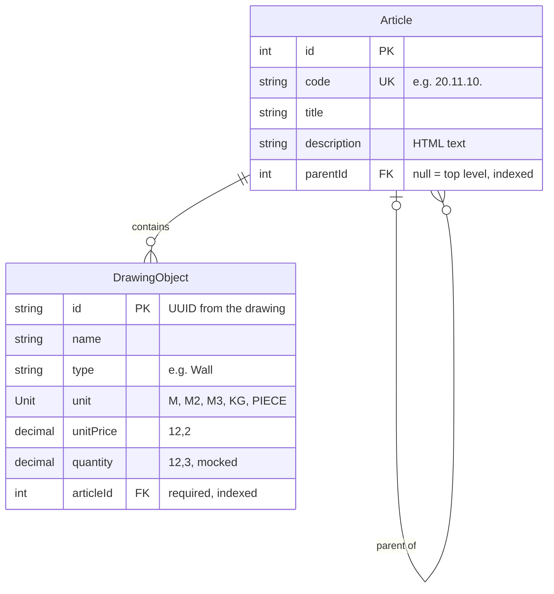

# Quantus — bill of quantities

A small bill of quantities app: a NestJS + PostgreSQL REST API and a Vue frontend,
started with a single `docker compose up`.

## 1. How to run

Requirements: Docker with Docker Compose.

```sh
docker compose up --build
```

| What | URL |
|---|---|
| Frontend | http://localhost:8080 |
| API | http://localhost:3000 |

## 2. API endpoints

_To be filled in._

## 3. Data model & why



- **`unit` is an enum:** we own this short list, and code depends on each value (every unit is measured differently from the drawing). The database rejects unknown units, and adding one is a migration plus code.
- **`type` is a plain string:** object types (Wall, Door, …) come from Vectorworks, not from us. An enum would reject real objects from the drawing just because their type wasn't known in advance.

## 4. Decisions

- **Vitest instead of Jest:** Nest 12's generator ships Vitest and ES modules by default. Jest would need extra config for ES modules, and Vitest's `describe` / `it` / `expect` reads the same.

## 5. Assumptions

- The Postgres credentials in `compose.yaml` are local development values, so the project runs from a clean checkout without creating a `.env` file first.
- The article tree is stored in `parentId`, and `code` must agree with it: a child's code is its parent's code plus one group (`20.` → `20.11.`), and a top-level code is a single group. Otherwise the two could contradict each other, for example `30.11.` under `20.`.
- Code groups use a fixed two-digit width (`20.02.`, not `20.2.`), so sorting codes as text gives the real order.
- The PDF lists units as "m, m², m³, kg, piece, …", so more units may come. They are an enum that a migration can extend.

## 6. Questions for imagineY

- Can an object exist without an article, for example when no criteria rule matches it yet? This project requires an article.
- Can one object match the criteria of several articles? This project allows exactly one article per object.

## 7. Future improvements

- With multiple projects, the same drawing UUID could appear twice, so an object's key would become (project, UUID).

## 8. Time spent

- Started: 2026-09-25 10:38
