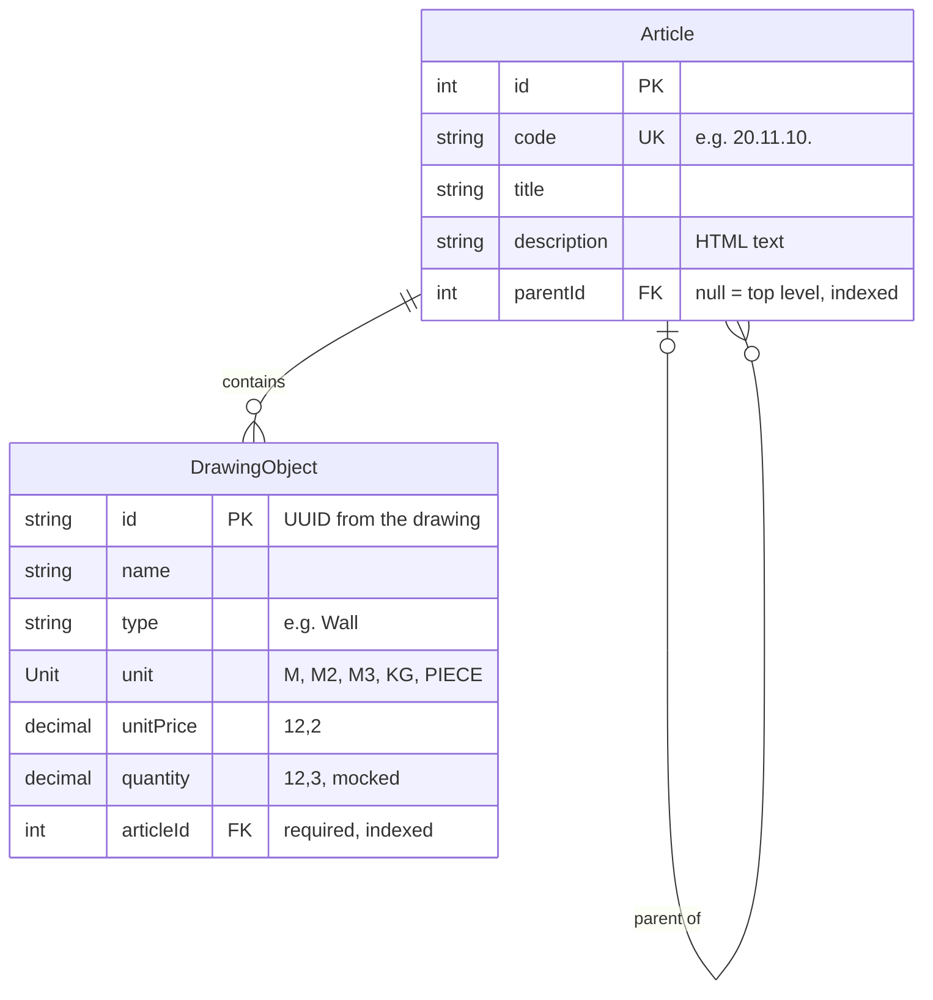

# Quantus — bill of quantities

A small bill of quantities: a NestJS + PostgreSQL REST API and a Vue frontend, started with a single
`docker compose up`. Articles nest like folders (`20.` → `20.11.` → `20.11.10.`), drawing objects belong
to an article, and `GET /summary` rolls every object up into its top-level article.

## 1. How to run

Requirements: Docker with Docker Compose. Ports 3000 and 8080 must be free.

```sh
docker compose up --build
```

The first build takes about two minutes. The API applies the database migrations itself when it starts.

| What | URL |
|---|---|
| Frontend | http://localhost:8080 |
| API | http://localhost:3000 (try http://localhost:3000/summary) |

In a second terminal, while the stack is running:

```sh
docker compose exec api npm run seed   # load the example project (safe to run more than once)
docker compose exec api npm test       # run the 27 tests
```

The seed is a small detached house: 6 chapters, 26 articles and 39 objects, using all 5 units and nesting
up to 4 levels deep. Its grand total is €59,340.11.

**In the frontend:**

- **Articles:** the list of all articles, indented by level, with the subtotal of each top-level article and
  the grand total.
- **New article:** code, title, description and parent. The code hint follows the chosen parent, and the API's
  error messages show up in the form.
- **An article's page:** its sub-articles, and every object below it with quantity, unit, unit price and line
  total, plus the total. The breadcrumb leads back up the tree.

Stop with `docker compose down`. To also delete the database and start empty, use `docker compose down -v`.

**Changing the schema:** edit `api/prisma/schema.prisma`, then create the migration inside a one-off API
container (it writes the new file into `api/prisma/migrations/`):

```sh
docker compose build api
docker compose run --rm -v ./api/prisma:/app/prisma api npx prisma migrate dev --name <what-changed>
```

## 2. API endpoints

| Method and path | What it does |
|---|---|
| `GET /articles` | All articles, ordered by code |
| `GET /articles/:id` | One article |
| `POST /articles` | Create an article: `code`, `title`, `description`, optional `parentId` |
| `PATCH /articles/:id` | Change any of those fields |
| `DELETE /articles/:id` | Delete an article that has no sub-articles and no objects |
| `GET /articles/:id/objects` | The article's objects with `lineTotal`, plus `total` and `currency`. Add `?includeSubArticles=true` to include the objects of every article below it |
| `GET /objects` | All objects |
| `GET /objects/:id` | One object (`:id` is the UUID from the drawing) |
| `POST /objects` | Create an object: `id`, `name`, `type`, `unit`, `unitPrice`, `quantity`, `articleId` |
| `PATCH /objects/:id` | Change any field except `id` |
| `DELETE /objects/:id` | Delete an object |
| `GET /summary` | The subtotal of every top-level article and the grand total |

```json
{ "currency": "EUR",
  "articles": [ { "id": 1, "code": "20.", "title": "Masonry", "subtotal": 15515.28 } ],
  "grandTotal": 59340.11 }
```

Errors:

| Status | When |
|---|---|
| 400 | Invalid input: a wrong code format, unknown fields, a negative price, a `parentId` or `articleId` that doesn't exist, or a code that doesn't fit its parent (see *Assumptions*) |
| 404 | Unknown id |
| 409 | Duplicate article code or object UUID; deleting an article that still has sub-articles or objects; changing the code of an article that has sub-articles |

## 3. Data model & why



- **Nesting with `parentId`:** each article points to its parent, and `null` means top level. This is the
  simplest way to store a tree, and it's enough for a bill of quantities of this size. The totals are calculated
  by walking up these links.
- **A number `id` next to the unique `code`:** codes are meaningful to people and may be renumbered;
  a fixed id keeps every link stable. The database still enforces that each code is unique.
- **`DrawingObject.id` is the UUID from the drawing,** supplied by the client instead of generated, so an
  object in the API is always the same object as in Vectorworks. The name `DrawingObject` avoids a clash
  with JavaScript's built-in `Object`.
- **`unit` is an enum:** we own this short list, and code depends on each value (every unit is measured
  differently from the drawing). The database rejects unknown units, and adding one is a migration plus code.
- **`type` is a plain string:** object types (Wall, Door, …) come from Vectorworks, not from us. An enum would
  reject real objects from the drawing just because their type wasn't known in advance.
- **Money and quantities are `Decimal`, never floating point:** `Decimal(12,2)` for prices and `Decimal(12,3)`
  for quantities, so 3 × 0.1 is exactly 0.30.
- **`articleId` is required:** every object belongs to exactly one article, like a file in a folder.
- **No cascade deletes:** both links use `ON DELETE RESTRICT`, so a delete can never silently remove a chapter's
  sub-articles or objects. The API answers 409 first; the database is the second line of defence.
- **Indexes on `parentId` and `articleId`,** because "children of X" and "objects of X" are the common lookups.

## 4. Decisions

- **NestJS 12 + Prisma 7 instead of Drizzle:** I know Prisma better, and its schema file reads almost like the
  diagram above. Migrations are plain SQL files committed to git.
- **Exact money, rounded only at output:** line totals, subtotals and the grand total are all added up
  unrounded; only the numbers leaving the API are rounded to cents (half up). The known trade-off: the rounded
  numbers shown can differ by a cent from their sum. Two subtotals of 1.125 show as 1.13 each, while the grand
  total is 2.25, not 2.26. The seed shows this on article `20.11.10.`.
- **All totals come from one function:** `rollUpTotals()` adds every object's line total to its own article
  and to every article above it. `/summary` and the article pages both use it, so they always agree.
- **Totals are calculated in memory from one snapshot:** each totals request reads all articles and objects in
  one `RepeatableRead` transaction, then pure TypeScript functions do the math. Pure functions are easy to test
  and explain; it's fast enough for a bill of quantities (see *Future improvements* for large projects).
- **All money math is in the API:** the frontend only formats numbers. There is one exact calculation, and no
  risk of browser float errors or a cent difference between screens.
- **No separate cycle check:** the code rule (a child's code is its parent's code plus one group) already makes
  a loop impossible, because codes get strictly longer going down the tree. Two unit tests prove it.
- **409 instead of cascade delete:** deleting data that others depend on must be a deliberate step.
- **Validation at the edge:** every request body and query is checked against a DTO with class-validator.
  Unknown fields are rejected rather than silently ignored, and the database adds its own limits.
- **Migrations run on every start (`prisma migrate deploy`):** a clean checkout always builds the same
  database, and `migrate deploy` only applies committed migrations; it never changes the schema by itself.
- **No `.env` file:** Docker Compose passes `DATABASE_URL` and `CURRENCY` to the API, and Postgres needs no port
  on your machine, so the project doesn't clash with a Postgres you already run.
- **Tests:** pure-function tests for the calculations and the code rule, plus endpoint tests that run the real
  controllers and services with a fake database, set up exactly like production.
- **Vitest instead of Jest:** Nest 12's generator ships Vitest and ES modules by default. Jest would need extra
  config for ES modules, and Vitest's `describe` / `it` / `expect` reads the same.
- **Frontend:** Vue 3 with Vue Router and Tailwind CSS v4 (the colors are design tokens in `@theme`, and all
  styling is utility classes in the templates). No state library; each page loads what it needs.
- **The seed uses upserts with fixed UUIDs,** like real drawing ids, so running it again updates the same rows
  instead of duplicating them.

## 5. Assumptions

- **The quantity is mocked:** it's stored on each object instead of being measured from the drawing, as the
  brief allows.
- **One currency per bill of quantities:** set with `CURRENCY` (`EUR` by default, or `USD`) in `compose.yaml`.
  Any other value stops the API at startup instead of showing the wrong currency. Prices exclude VAT.
- **Every object belongs to exactly one article,** chosen when the object is created. Assigning objects through
  criteria rules is left out (see *Questions*).
- **The article tree and the code must agree:** a child's code is its parent's code plus one group
  (`20.` → `20.11.`), and a top-level code is one group. Otherwise the two could contradict each other,
  for example `30.11.` under `20.`. As a result, the code of an article that has sub-articles can't change.
- **Code groups have two digits** (`20.02.`, not `20.2.`), so sorting codes as text gives the real order.
  The API enforces this.
- **The description is stored as HTML text,** standing in for rich text. The frontend doesn't render it.
- **The unit list may grow:** the brief lists units as "m, m², m³, kg, piece, …". Units are an enum that a
  migration can extend.
- **The Postgres credentials in `compose.yaml` are local development values,** so the project runs from a clean
  checkout without creating a `.env` file first.

## 6. Questions for imagineY

- Can an object exist without an article, for example when no criteria rule matches it yet? This project
  requires an article.
- Can one object match the criteria of several articles? This project allows exactly one article per object.
- How are criteria rules defined, and who maintains them: per project, or as a shared library?
- Which drawing property gives the quantity for each unit (length, area, volume, weight, count), and who
  decides it?
- Do article codes always use two-digit groups, and can a project renumber its articles?
- Is one currency per project enough, and should prices include VAT?
- Which rich-text format do descriptions use today (HTML, Markdown, something else)?

## 7. Future improvements

- **Criteria rules engine:** assign objects to articles automatically ("all walls of 14 cm → `20.11.10.`").
- **Real quantities** measured from the Vectorworks object properties instead of the mocked value.
- **Projects:** several bills of quantities in one database; an object's key would then become
  (project, drawing UUID), because the same UUID could appear in two drawings.
- **Large trees:** a recursive SQL query (CTE) instead of loading all articles and objects for the totals.
- **Totals for every level on the list page:** each article page already shows its own total including
  sub-articles, but the list only shows the top-level subtotals from `/summary`.
- **Editing and deleting in the frontend,** with a rich-text editor for descriptions (sanitized before display).
- **Moving an article that has sub-articles,** renumbering the whole subtree in one step.
- **Multiple currencies** with exchange rates, and VAT handling.
- **Authentication and user roles.**
- **API documentation** with OpenAPI / Swagger.
- **End-to-end tests** against a real database, and a CI pipeline that runs them on every push.
- **Ids above 2,147,483,647** currently give a 500 instead of a 400.
- **Mobile:** the wide tables scroll sideways on a phone; a card layout would read better there.
